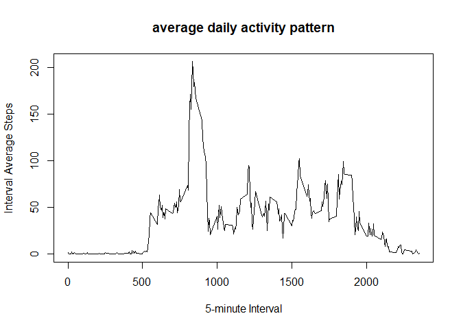

```r
knitr::opts_chunk$set(echo = TRUE)
```

### Loading/Reading the data

Note that the variable to track the number steps has 2304 missing entries 'NA'.


```r
myfile <- read.csv(unz("activity.zip", "activity.csv"),header=T,)
summary(myfile)
```

```
##      steps                date          interval     
##  Min.   :  0.00   2012-10-01:  288   Min.   :   0.0  
##  1st Qu.:  0.00   2012-10-02:  288   1st Qu.: 588.8  
##  Median :  0.00   2012-10-03:  288   Median :1177.5  
##  Mean   : 37.38   2012-10-04:  288   Mean   :1177.5  
##  3rd Qu.: 12.00   2012-10-05:  288   3rd Qu.:1766.2  
##  Max.   :806.00   2012-10-06:  288   Max.   :2355.0  
##  NA's   :2304     (Other)   :15840
```

### Preprocessing the data - Remove Missing values (NA)

1. Use the variable date to determine if it is a weekday or weekend.
2. Classify day of the week into two groups: weekday and weekend
3. Define a subset of records without any missing values.


```r
myfile$day <- weekdays(as.Date(myfile$date))
unique(myfile$day)
```

```
## [1] "Monday"    "Tuesday"   "Wednesday" "Thursday"  "Friday"    "Saturday" 
## [7] "Sunday"
```

```r
is_weekend <- myfile$day %in% c("Saturday","Sunday")
myfile$day_type <- "weekday"
myfile[is_weekend,]$day_type <- "weekend"
unique(myfile$day_type)
```

```
## [1] "weekday" "weekend"
```

```r
x <- as.data.frame(myfile[complete.cases(myfile), ])
summary(x)
```

```
##      steps                date          interval          day           
##  Min.   :  0.00   2012-10-02:  288   Min.   :   0.0   Length:15264      
##  1st Qu.:  0.00   2012-10-03:  288   1st Qu.: 588.8   Class :character  
##  Median :  0.00   2012-10-04:  288   Median :1177.5   Mode  :character  
##  Mean   : 37.38   2012-10-05:  288   Mean   :1177.5                     
##  3rd Qu.: 12.00   2012-10-06:  288   3rd Qu.:1766.2                     
##  Max.   :806.00   2012-10-07:  288   Max.   :2355.0                     
##                   (Other)   :13536                                      
##    day_type        
##  Length:15264      
##  Class :character  
##  Mode  :character  
##                    
##                    
##                    
## 
```

### Plot Histogram of the total number of steps taken each day

```r
require(dplyr)
```

```
## Loading required package: dplyr
```

```
## 
## Attaching package: 'dplyr'
```

```
## The following objects are masked from 'package:stats':
## 
##     filter, lag
```

```
## The following objects are masked from 'package:base':
## 
##     intersect, setdiff, setequal, union
```

```r
daily_steps_sum<- x %>% group_by(as.factor(date)) %>% summarize(Total_Steps=sum(steps))
hist(daily_steps_sum$Total_Steps,main = "Histogram of total number of steps taken per day", xlab = "Total number of steps", ylim=c(0,30))
```

<!-- -->

### Find Mean and median number of steps taken per day

```r
steps_tally<-summary(daily_steps_sum)
paste(steps_tally[3,2],steps_tally[4,2],sep='    ')
```

```
## [1] "Median :10765      Mean   :10766  "
```

### Time series plot of average daily activity pattern in terms of average number of steps taken

```r
require(dplyr)
steps_mean_interval <- x %>% group_by(interval) %>% summarize(mean_steps_interval=mean(steps))
str(steps_mean_interval)
```

```
## Classes 'tbl_df', 'tbl' and 'data.frame':	288 obs. of  2 variables:
##  $ interval           : int  0 5 10 15 20 25 30 35 40 45 ...
##  $ mean_steps_interval: num  1.717 0.3396 0.1321 0.1509 0.0755 ...
```

```r
plot(y=steps_mean_interval$mean_steps_interval,x=steps_mean_interval$interval, type="l", xlab="5-minute Interval", ylab="Interval Average Steps", main="average daily activity pattern")
```

<!-- -->

### Find the 5-minute interval that, on average, contains the maximum number of steps

1. Find the index where the maximum average number of step is.
2. Find the 5-minute interval with the found index.


```r
index <-which.max(steps_mean_interval$mean_steps_interval)
steps_mean_interval$interval[index]
```

```
## [1] 835
```

### Panel plot comparing the average number of steps taken per 5-minute interval across weekdays and weekends

It can seen that people were walking more over the weekends.


```r
require(dplyr)
steps_mean_wkday <- x %>% group_by(day_type, interval) %>% summarize(mean_Steps_day=mean(steps))
str(steps_mean_wkday)
```

```
## Classes 'grouped_df', 'tbl_df', 'tbl' and 'data.frame':	576 obs. of  3 variables:
##  $ day_type      : chr  "weekday" "weekday" "weekday" "weekday" ...
##  $ interval      : int  0 5 10 15 20 25 30 35 40 45 ...
##  $ mean_Steps_day: num  2.333 0.462 0.179 0.205 0.103 ...
##  - attr(*, "vars")= chr "day_type"
##  - attr(*, "drop")= logi TRUE
```

```r
par(mfrow=c(2,1))
lapply(unique(x$day_type), function(wkday) {
  wkday_data <- steps_mean_wkday[which(steps_mean_wkday$day_type==wkday),]
  wkday_p<-plot(wkday_data$mean_Steps_day ~ wkday_data$interval, xlab=wkday,
    ylab="avg steps per 5-min interval", type="l")
  wkday_p
  }
)
```

<!-- -->

```
## [[1]]
## NULL
## 
## [[2]]
## NULL
```

### Srategy and codes for imputing missing values

1. The variable steps has total 2304 missing values in the dataset, i.e. the total number of rows with NAs.

```r
is_missing <- is.na(myfile$steps)
table(is_missing)
```

```
## is_missing
## FALSE  TRUE 
## 15264  2304
```
2. The strategy is to use the mean of each 5-minute interval for either weekend or weekday to fill in all of the missing values for steps variable in the dataset.


```r
library(dplyr)
myfile$steps_imp <- myfile$steps 
myfile <- left_join(myfile, steps_mean_wkday, by = c("day_type","interval"))
myfile <- transform(myfile, steps_imp=ifelse(is.na(steps), mean_Steps_day, steps))
head(myfile)
```

```
##   steps       date interval    day day_type steps_imp mean_Steps_day
## 1    NA 2012-10-01        0 Monday  weekday 2.3333333      2.3333333
## 2    NA 2012-10-01        5 Monday  weekday 0.4615385      0.4615385
## 3    NA 2012-10-01       10 Monday  weekday 0.1794872      0.1794872
## 4    NA 2012-10-01       15 Monday  weekday 0.2051282      0.2051282
## 5    NA 2012-10-01       20 Monday  weekday 0.1025641      0.1025641
## 6    NA 2012-10-01       25 Monday  weekday 1.5128205      1.5128205
```

### Histogram of the total number of steps taken each day after missing values are imputed

```r
require(dplyr)
steps_imp_sum<- myfile %>% group_by(as.factor(date)) %>% summarize(Total_Steps=sum(steps_imp))
str(steps_imp_sum)
```

```
## Classes 'tbl_df', 'tbl' and 'data.frame':	61 obs. of  2 variables:
##  $ as.factor(date): Factor w/ 61 levels "2012-10-01","2012-10-02",..: 1 2 3 4 5 6 7 8 9 10 ...
##  $ Total_Steps    : num  10177 126 11352 12116 13294 ...
```

```r
hist(steps_imp_sum$Total_Steps,main = "Histogram of total number of steps with imputation taken per day", xlab = "Total number of steps imputed", ylim=c(0,40))
```

<!-- -->
